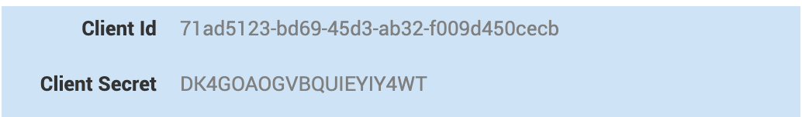
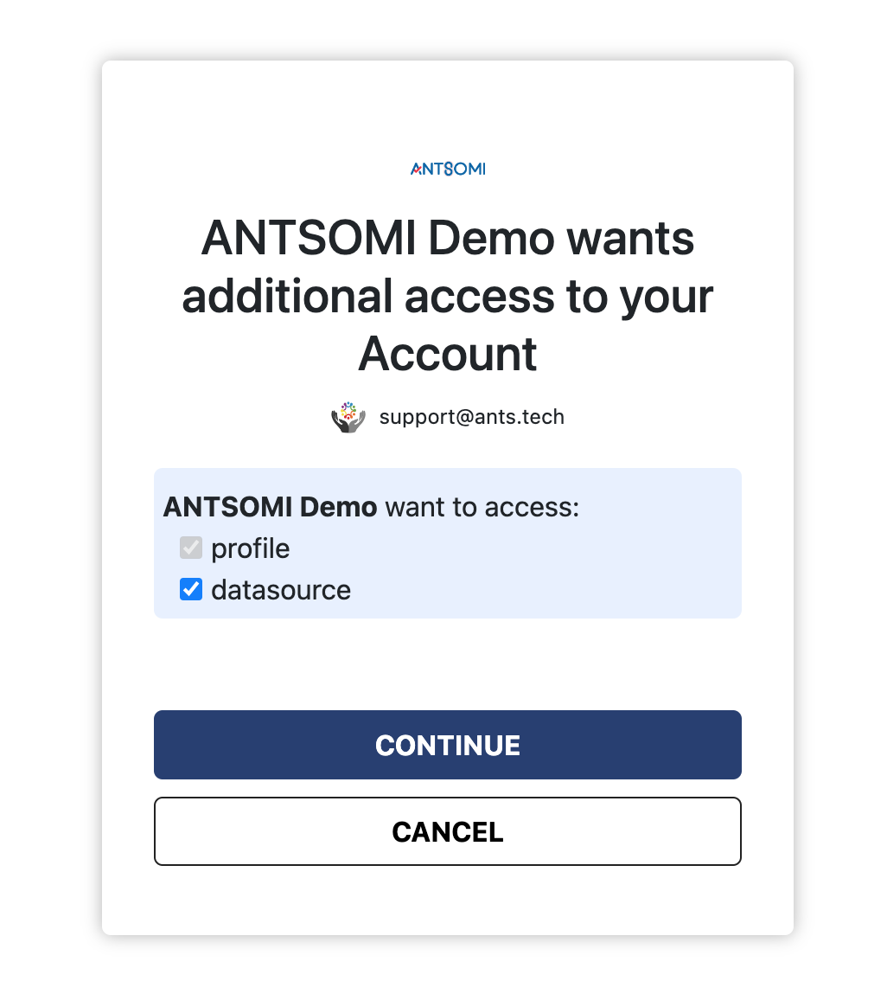

The Authorization Code Flow is used for applications to request permission from a Antsomi member to access their account data. The level of access or profile detail is explicitly requested using the scope parameter during the authorization process outlined below. This workflow will send a consent prompt to a selected member, and once approved your application may begin making API calls on behalf of that member.

This approval process ensures that Antsomi members are aware of what level of detail an application may access or action it may perform on their behalf.

If multiple scopes are requested, the user must be consent to all of them and may not select individual scopes. For the benefit of your Antsomi users, please ensure that your application requests the least number of scope permissions.

## Authorization Code Flow ##
- Configure your application to obtain Client ID and Client Secret.
- Your application directs the browser to Antsomi OAuth 2.0 authorization page where the user authenticates.
- After authentication, Antsomi's authorization server passes an authorization code to your application.
- Your application sends this code to Antsomi and Antsomi returns an access token.
- Your application uses this token to make API calls on behalf of the user.

### Step 1: Configure your application ###
- Contact to AM to create an application to obtain Client ID and Client Secret.
- Provide the redirect (callback) URL to your server.
    - URLs must be absolute:
    https://dev.example.com/auth/callback
    not /auth/callback
    - parameters are ignored:
    https://dev.example.com/auth/callback?id=1
    will be https://dev.example.com/auth/callback

Each application is assigned a unique Client ID (Consumer key/API key) and Client Secret. Please make a note of these values as they will be integrated into your application. Your Client Secret protects your application's security so be sure to keep it secure!

:::warning Warning
Do not share your Client Secret value with anyone, and do not pass it in the URL when making API calls, or URI query-string parameters, or post in support forums, chat, etc.
:::

### Step 2: Request an Authorization Code
To request an authorization code, you must direct the user's browser to Antsomi's OAuth 2.0 authorization page, where the user either accepts or denies your application's permission request.

When the member completes the authorization process, the browser is redirected to the URL provided in the redirect_uri query parameter.

<!-- :::note
If the scope permissions are changed in your app, your users must re-authenticate to ensure that they have explicitly granted your application all of the permissions that it is requesting on their behalf.
::: -->

<!-- Once the request is made, one of the following occurs:

If it is a first-time request, the permission request timed out, or was manually revoked by the member: the browser is redirected to LinkedIn's authorization consent window.

If there is an existing permission grant from the member: the authorization screen is bypassed and the member is immediately redirected to the URL provided in the redirect_uri query parameter. -->

>GET https://iam.ants.tech/oauth/login

| Parameter | Type | Description |
| --------- | ---- | ----------- |
|response_type| string| The value of this field should always be: *code* |
|client_id | string | Required The ID of the client |
| redirect_uri | string (url) | The URI your users are sent back to after authorization. This value must match one of the Redirect URLs defined in your application configuration. For example, https://dev.example.com/auth/callback. |
| state | string | A unique string value of your choice that is hard to guess. Used to prevent CSRF. For example, state=DCEeFWf45A53sdfKef424. |
| scope | string | URL-encoded, space-delimited list of user permissions your application is requesting on behalf of the user. These must be explicitly requested